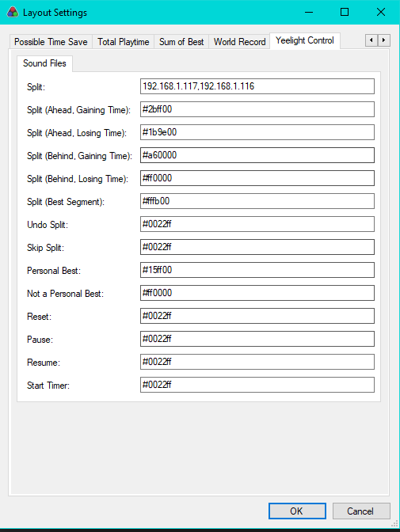

# LiveSplit.Yeelight

This module connect your splits to your Yeelight color bulb/LEDS
This module has been created using LiveSplit.Sound as a code base

# Install

Download the .dll in the release section, and move it to your LivesplitFolder/Components. You also need YeelightAPI.dll and Newtonsoft.Json.
You can add it to your layout in (+) -> Control -> Yeelight Control

# Usage

When livesplit start, it will light up all configured bulb in white.
On split, you can configure colors for gaining time / loosing time / reset (etc), this color will be broadcast to all the bulb

You can configure multiple light by separating them with a comma (no space)
Color is configured using hexadecimal (# is important !)

